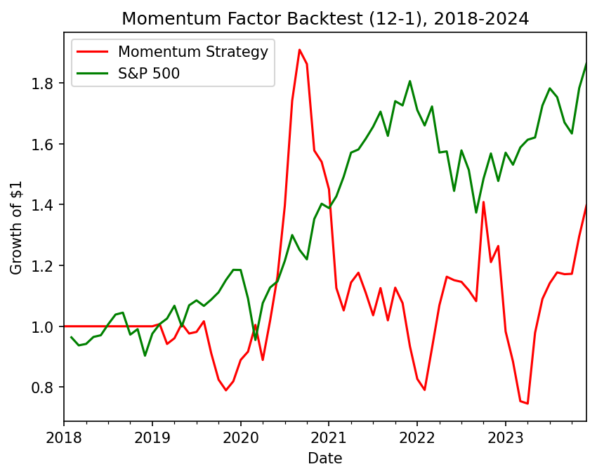

# Momentum Factor Backtest (12-1 Strategy)

A long-short momentum strategy that ranks stocks by past performance and tests whether recent winners continue to outperform recent losers.

## What is Momentum Investing?

Momentum investing is based on the idea that stocks that have performed well recently tend to continue outperforming, while stocks that have performed poorly tend to continue underperforming. Rather than identifying undervalued companies, momentum investors focus on the persistence of market trends — buying recent winners and shorting recent losers. This strategy is based on the academic momentum factor first documented by Jegadeesh and Titman (1993).

## Methodology

### Data

Historical adjusted price data was downloaded via Yahoo Finance using the `yfinance` library. The universe consists of 29 large-cap US stocks spanning nine sectors — technology, financials, healthcare, energy, consumer, industrials, media/communications, and materials/utilities — chosen to reduce sector concentration relative to a narrower, tech-heavy universe.

Daily prices were resampled to monthly frequency by taking the final closing price of each month.

### The 12-1 Momentum Signal

For each stock, the momentum score was calculated as the sum of monthly returns over the previous 11 months, skipping the most recent month. This gives a signal based on returns from months t-12 to t-2. The most recent month is excluded because short-term price movements tend to exhibit mean reversion, which weakens the signal.

### Portfolio Construction

At the end of each month:

- Stocks are ranked by momentum score.
- The top decile (~10%) of stocks are held long.
- The bottom decile (~10%) are held short.
- All other stocks are excluded.

The number of long/short positions scales with the number of valid stocks available each month (accounting for missing data early in the backtest), rather than being fixed.

Long and short positions are equal-weighted within each side of the portfolio, resulting in a dollar-neutral long-short portfolio.

### Avoiding Lookahead Bias

Portfolio positions were shifted forward by one month before calculating returns. This ensures that momentum signals calculated at the end of month t are only applied to returns in month t+1 — reflecting what would have been knowable in real time.

### Limitations

This backtest uses a fixed universe of current large-cap constituents, which introduces survivorship bias — companies that were delisted, acquired, or went bankrupt during the test period are excluded, likely inflating returns relative to a point-in-time investable universe. Transaction costs are also not modelled, despite meaningful monthly turnover (see below).

## Results

The equity curve tracks the growth of $1 invested in the strategy from 2018 to 2024. The S&P 500 is included as a passive benchmark to provide context for the strategy's performance.

The strategy generated its strongest performance during the sharp market recovery following the March 2020 COVID-19 sell-off, peaking at approximately $1.90 before giving back much of those gains as market leadership rotated.

### Risk Metrics

| Metric | Value |
|---|---|
| Annualised Return | 5.75% |
| Annualised Volatility | 35.72% |
| Sharpe Ratio | 0.16 |
| Max Drawdown | -60.93% |
| Hit Rate | 41.67% |
| Avg Monthly Turnover | 52.78% |

*Note: Sharpe ratio is calculated without subtracting a risk-free rate (i.e. assumes a 0% risk-free rate) for simplicity.*

- **Sharpe Ratio**: risk-adjusted return — return earned per unit of volatility taken.
- **Max Drawdown**: the largest peak-to-trough decline in portfolio value over the backtest period.
- **Hit Rate**: the percentage of months with a positive return.
- **Turnover**: the average monthly proportion of the portfolio replaced at each rebalance. Higher turnover generally implies higher transaction costs.

### Interpretation

The low Sharpe ratio (0.16) and hit rate (41.67%) indicate the strategy's profitability is concentrated in a small number of strong months — most notably the recovery following the March 2020 sell-off — rather than being consistently profitable. This pattern is consistent with a well-documented weakness of momentum strategies: momentum crashes (Daniel & Moskowitz, 2016), where sharp reversals following a market bottom cause short positions (recent losers) to rally while long positions (recent winners) stagnate, driving the strategy's -60.93% max drawdown.

The high average monthly turnover (52.78%) suggests transaction costs, not modelled here, would meaningfully erode these already modest returns in practice.

Overall, the backtest demonstrates that while a naïve implementation of the classic 12-1 momentum factor can capture periods of strong trend persistence, it also exhibits substantial drawdowns and high turnover. The results highlight why practical momentum strategies typically incorporate risk management, transaction cost modelling and more sophisticated portfolio construction techniques.

## Possible Extensions

- Volatility-scaled position sizing to reduce exposure to momentum crashes.
- Transaction cost modelling to better reflect live tradability.
- Point-in-time constituent data to address survivorship bias.
- Sector-neutral construction to reduce concentration risk within the long/short legs.

## Libraries

- `pandas` — data manipulation and time series resampling
- `numpy` — numerical operations
- `matplotlib` — plotting the equity curve
- `yfinance` — downloading historical price data